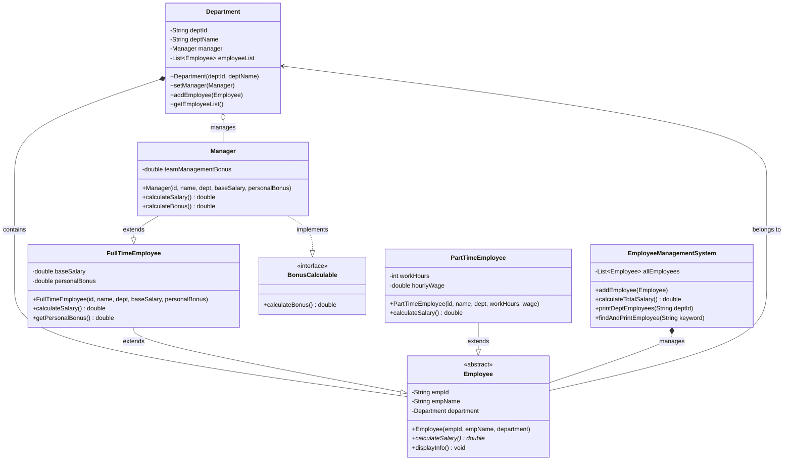

# 第二讲实践任务2.2：员工管理系统与薪资计算

## 🎯 实验目的
1. 深入理解**抽象类（Abstract Class）**与**抽象方法**的作用。
2. 掌握类的**继承（Inheritance）**关系及**多态（Polymorphism）**的应用。
3. 掌握**接口（Interface）**的定义与实现。
4. 理解对象之间的关联关系（如员工与部门的关联）。
5. 掌握集合（如 `ArrayList`）在对象管理系统中的基本使用。

---

## 📊 UML 类图 (System Design)

为了更直观地理解系统架构，请参考以下UML类图设计（*使用Mermaid语法绘制，支持Markdown的阅读器可直接渲染图形*）：

---

## 📝 详细实验要求

请按照以下顺序和要求依次实现各个类与接口：

### 1. 部门类：`Department`
表示公司内的一个部门。
*   **属性**（私有）：
    *   `deptId` (`String`)：部门编号
    *   `deptName` (`String`)：部门名称
    *   `manager` (`Manager`)：部门经理
    *   `employeeList` (`List<Employee>`)：本部门全体员工列表 *(教学提示：为了便于后续经理计算团队奖金，部门需要能获取自己部门下的所有员工)*
*   **方法**：构造方法（初始化编号和名称，实例化List）、相应的 getter/setter 方法、以及 `addEmployee(Employee emp)` 方法用于将员工加入部门名单。

### 2. 抽象员工类：`Employee`
所有具体员工的基类。
*   **属性**（私有或受保护）：`empId` (员工编号)、`empName` (姓名)、`department` (所属部门类型为 `Department`)。
*   **构造方法**：接收并初始化上述三个属性。
*   **抽象方法**：`public abstract double calculateSalary();` （不同的员工薪资计算方式不同，交由子类实现）。
*   **具体方法**：`public void displayInfo();` （在控制台按行打印员工基础信息，格式要求：`属性名：属性值`，例如：`员工编号：E001`）。

### 3. 具体员工子类：全职与兼职
#### 3.1 全职员工类：`FullTimeEmployee` (继承 `Employee`)
*   **新增属性**：`baseSalary` (基本工资)、`personalBonus` (个人奖金)。
*   **方法实现**：
    *   实现 `calculateSalary()`：薪资 = 基本工资 + 个人奖金。
    *   重写 `displayInfo()`：先调用父类方法打印基础信息，再打印全职专属的工资和奖金信息。
    *   提供 `getPersonalBonus()` 方法获取个人奖金。

#### 3.2 兼职员工类：`PartTimeEmployee` (继承 `Employee`)
*   **新增属性**：`workHours` (工作时间)、`hourlyWage` (每小时工资)。
*   **方法实现**：
    *   实现 `calculateSalary()`：薪资 = 工作时间 × 每小时工资。
    *   重写 `displayInfo()`：打印基础信息及兼职专属属性。

### 4. 接口与经理类
#### 4.1 奖金计算接口：`BonusCalculable`
*   包含一个方法：`double calculateBonus();`

#### 4.2 经理类：`Manager` (继承 `FullTimeEmployee`，实现 `BonusCalculable`)
*   **新增属性**：`teamManagementBonus` (团队管理奖金，初始可设为0，通过计算得出)。
*   **接口方法实现 `calculateBonus()`**：
    *   **计算规则**：经理总奖金 = 个人奖金 + 团队管理奖金。
    *   **核心逻辑**：团队管理奖金 = 所管理部门的本级全体员工（不含经理自己）个人奖金之和的 **10%**。*(提示：通过 `this.getDepartment().getEmployeeList()` 遍历部门员工，判断如果是 `FullTimeEmployee` 则累加其个人奖金，最后乘以 0.1)*。
*   **重写 `calculateSalary()`**：经理薪资 = 基本工资 + `calculateBonus()`计算出的总奖金。

### 5. 系统管理类：`EmployeeManagementSystem`
用于统一调度和管理所有员工。
*   **属性**：`List<Employee> allEmployees` (系统总员工集合)。
*   **核心方法**：
    1.  `addEmployee(Employee emp)`：将员工加入系统，同时如果员工有部门，需调用部门的 `addEmployee` 方法将员工加入部门名单。
    2.  `calculateTotalSalary()`：遍历系统全体员工，利用**多态**调用各自的 `calculateSalary()` 方法，计算并返回公司总薪资开销。
    3.  `printDeptEmployees(String deptId)`：根据部门编号，遍历打印该部门**本级全体员工**的信息。
    4.  `findAndPrintEmployee(String keyword)`：根据员工编号 **或** 姓名进行查找，若找到则调用其 `displayInfo()` 方法，未找到则提示“查无此人”。

---

## 💻 模拟测试流程 (`Main` 类要求)

请创建一个主测试类，按以下流程编写代码验证系统功能：

1. **环境初始化**：
   * 创建一个研发部 `Department` (编号: D01, 名称: 研发部)。
   * 创建一个 `EmployeeManagementSystem` 系统对象。
2. **人员录入**：
   * 创建 2 名全职员工（基本工资+个人奖金），归属研发部。
   * 创建 1 名兼职员工（工时+时薪），归属研发部。
   * 创建 1 名经理（归属研发部，设置为该部门经理）。
   * 将以上 4 人全部通过系统的 `addEmployee` 方法录入。
3. **功能测试**：
   * **功能1**：调用按部门编号打印员工信息的方法，传入 "D01"。
   * **功能2**：分别调用按编号查找（如查兼职员工）和按姓名查找（如查经理），触发 `displayInfo()`。
   * **功能3**：调用总薪资计算方法，打印公司总薪资开销。*(需手动核算一下经理的薪资是否正确包含了10%的团队奖金)*。

---

## 💡 教学提示与思考题
1. **多态的魅力**：在 `calculateTotalSalary()` 方法中，你是否发现无论集合里装的是全职、兼职还是经理，只需统一调用 `calculateSalary()` 即可？Java是如何知道该执行哪种计算公式的？
2. **抽象与接口的选择**：为什么 `Employee` 设计为抽象类，而 `BonusCalculable` 设计为接口？能否将计算奖金的方法直接放到 `Employee` 类中？为什么不好？
3. **安全向下转型**：在经理计算团队奖金时，遍历部门员工列表，遇到兼职员工（没有奖金）时，应如何使用 `instanceof` 关键字来避免程序报错？