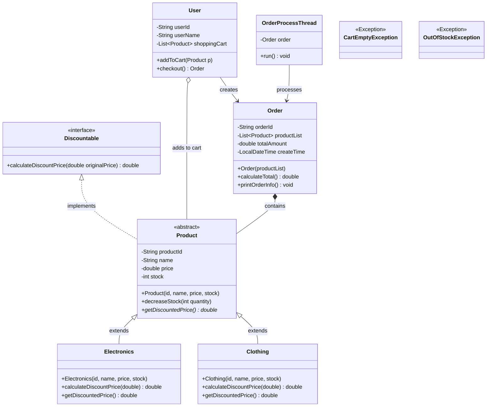

# 第二讲实践任务2.3：电商购物与订单处理系统

## 🎯 实验目的
1.  **综合运用面向对象设计**：熟练掌握接口（Interface）、抽象类及多态在复杂业务（如不同商品折扣计算）中的应用。
2.  **掌握Java 8+日期时间API**：使用 `java.time` 包处理订单的创建时间与格式化输出。
3.  **精通异常处理机制**：自定义业务异常（Checked / Unchecked Exception），并在业务逻辑中进行抛出与捕获。
4.  **掌握多线程编程**：利用多线程（`Thread` 或 `Runnable`）模拟后台异步处理订单及支付流程。
5.  **掌握JUnit单元测试**：使用 JUnit 框架对核心业务逻辑（折扣计算、总价计算、异常抛出）进行自动化测试。

---

## 📊 UML 类图 (System Design)

---

## 📝 详细实验要求

### 1. 异常处理设计 (Exception Handling)
定义两个自定义异常类，用于处理业务错误：
*   **`OutOfStockException`** (继承 `Exception` 或 `RuntimeException`)：商品库存不足时抛出。
*   **`CartEmptyException`** (继承 `Exception`)：当购物车为空却尝试去结账（下单）时抛出。

### 2. 基础类与多态设计 (Polymorphism & Interfaces)
#### 2.1 接口 `Discountable`
*   包含方法：`double calculateDiscountPrice(double originalPrice);`

#### 2.2 抽象类 `Product` (实现 `Discountable`)
*   **属性**：`productId`, `name`, `price` (原价), `stock` (库存量)。
*   **抽象方法**：`public abstract double getDiscountedPrice();`
*   **普通方法**：`decreaseStock()` 减少库存，若库存为0则抛出 `OutOfStockException`。

#### 2.3 具体商品类 (继承 `Product`)
*   **`Electronics` (电子产品)**：实现折扣逻辑（例如：原价满 5000 元打 9 折，否则不打折）。
*   **`Clothing` (服装)**：实现折扣逻辑（例如：全场无门槛 8 折）。
*   *要求：这两个类在 `getDiscountedPrice()` 方法中调用自身的 `calculateDiscountPrice` 来返回最终价格。*

### 3. 日期处理与核心业务类 (Date Processing)
#### 3.1 订单类 `Order`
*   **属性**：`orderId` (可使用 `UUID.randomUUID()` 自动生成)、`productList`、`totalAmount`、`createTime` (类型必须为 `java.time.LocalDateTime`)。
*   **方法 `calculateTotal()`**：遍历商品列表，累加每个商品的**折后价格** (`getDiscountedPrice()`)。
*   **方法 `printOrderInfo()`**：打印订单详情。要求使用 `DateTimeFormatter` 将 `createTime` 格式化为 `yyyy-MM-dd HH:mm:ss` 的字符串并输出。

#### 3.2 用户类 `User`
*   **属性**：`userId`, `userName`, `shoppingCart` (`List<Product>`)。
*   **方法 `addToCart(Product p)`**：将商品加入购物车，加入前先调用商品的 `decreaseStock()`，若捕获到 `OutOfStockException` 则提示添加失败。
*   **方法 `checkout()`**：结账操作。判断购物车是否为空，为空则抛出 `CartEmptyException`；否则，利用购物车中的商品生成一个 `Order` 对象，清空购物车，并返回该订单对象。

### 4. 多线程异步处理 (Multithreading)
电商系统中，订单生成后通常会交由后台异步处理（如发货准备、扣款等），避免让用户长时间等待。
*   **编写 `OrderProcessThread` 类** (实现 `Runnable` 接口或继承 `Thread` 类)。
*   **功能**：接收一个 `Order` 对象。在 `run()` 方法中，使用 `Thread.sleep(3000)` 模拟耗时 3 秒的处理过程，结束后在控制台打印：“【系统通知】订单 [订单号] 已异步处理完毕，进入发货流程...”。

---

## 🧪 JUnit单元测试要求 (JUnit Testing)

必须创建一个独立的测试类 `ECommerceSystemTest`，使用 JUnit 4 或 JUnit 5 编写以下测试用例（Test Cases）：

1.  **测试折扣逻辑 (`testDiscountCalculation`)**：
    *   断言一件价值 6000 元的电子产品，其折后价等于 5400。
    *   断言一件价值 200 元的服装，其折后价等于 160。
2.  **测试订单总金额 (`testOrderTotalCalculation`)**：
    *   手动创建一个包含上述两件商品的订单，断言订单的总金额等于 `5400 + 160 = 5560`。
3.  **测试异常抛出 (`testExceptionThrowing`)**：
    *   创建一个新用户，不添加任何商品，直接调用 `checkout()`，断言系统会抛出 `CartEmptyException`。(提示：JUnit5 可使用 `assertThrows`)。
    *   将某商品库存设为 0，尝试 `addToCart`，断言系统能正确抛出 `OutOfStockException`。

---

## 💻 场景模拟程序 (Main Application)

编写一个 `Main` 类，模拟一次完整的用户购物体验，要求在控制台看到完整的流程输出：

1.  初始化商品数据（一部手机库存2，一件外套库存1）。
2.  创建用户对象。
3.  尝试加入库存为0的商品，演示异常被捕获的提示。
4.  用户正常添加手机和外套到购物车。
5.  用户执行结账 (`checkout`)，捕获并处理可能发生的异常。
6.  结账成功后，打印订单详情（包含格式化后的时间戳和折后总价）。
7.  **启动多线程**：将生成的订单交给 `OrderProcessThread` 并在新线程中启动（`new Thread(processTask).start()`）。
8.  主线程打印：“主线程：用户已支付，正在浏览其他商品...”，验证多线程的异步不阻塞特性。

---

## 💡 进阶挑战（选做）
1. **多线程并发安全**：如果两个用户（两个线程）同时抢购同一件库存为 1 的商品，如何修改 `decreaseStock()` 方法（提示：使用 `synchronized` 或 `ReentrantLock`）来防止“超卖”现象？
2. **Lambda与Stream API**：在 `Order` 类的 `calculateTotal()` 方法中，尝试放弃使用传统的 `for` 循环，改用 Java 8 的 Stream API (`productList.stream().mapToDouble(...).sum()`) 来计算总价。